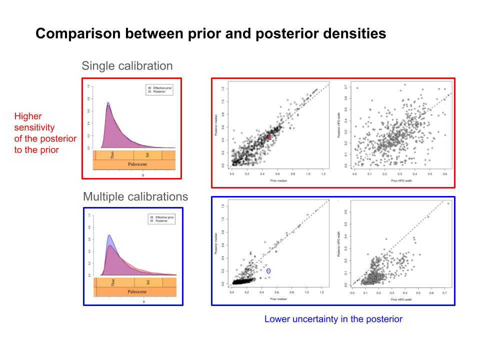
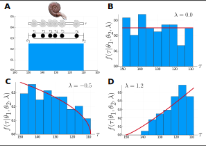
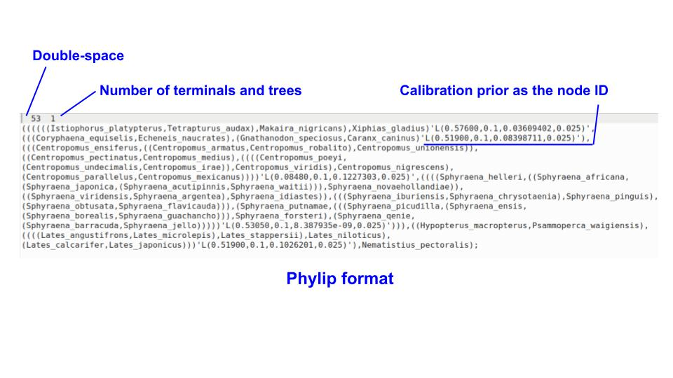

```{r klippy_bash, echo=FALSE, include=TRUE}
klippy::klippy('bash',
               position = c('top', 'right'),
               color = 'gray', 
               tooltip_message = 'Click to copy', tooltip_success = 'Done')
```

```{r klippy, echo=FALSE, include=TRUE}
klippy::klippy('r',
               position = c('top', 'right'),
               color = 'gray', 
               tooltip_message = 'Click to copy', tooltip_success = 'Done')
```

El primer paso para establecer los puntos de calibración es definir qué información de tiempo (edad) independiente tenemos disponible para informar ciertos nodos en la filogenia. Conocer los detalles de la fuente de esa información (e.g. geocronología, estratigrafía, 95% HPD de un análisis previo) es fundamental para decidir qué tipo de distribución estadística representa mejor la incertidumbre asociada dicha información de tiempo. Adicionalmente, tenemos que establecer los nodos que van a ser calibrados y numerarlos.

### Definir el directorio de trabajo
```{r, class.source='klippy', results='hide'}
getwd() # Muestra el directorio en el que estamos
```

```{r, class.source='klippy', results='hide', eval=FALSE}
# En caso de no estar en el directorio del repositorio del curso
setwd("/mnt/c/Users/UserName/Minicurso_divtimes_colevol2026")
# es posible que la carpeta esté en esta localización también:
setwd("/home/UserName/Minicurso_divtimes_colevol2026")
```

### Cargar los paquetes
```{r, class.source='klippy', results='hide'}
library(ape)
library(tbea)
library(mcmc3r)
```

### Examinar la filogenia y a numerar los nodos
```{r fig.height=8, fig.width=6, class.source='klippy'}
## Leer el arbol inicial
tree <- read.nexus("data/posterior_maxcred.tre")

## Establece la raiz
tree <- root(phy=tree, outgroup="Nematistius_pectoralis", resolve.root=TRUE)

## Obtener informacion del arbol
print(tree)
is.rooted(tree)
is.binary(tree)

## Plotar el arbol
plot.phylo(x=ladderize(phy=tree, right=FALSE),
           cex=0.7, label.offset=0.02)
nodelabels(cex=0.55, frame="circle", bg="white")
```

Dado que el árbol que la topología que vamos a fijar para el análisis con MCMCtree no debe tener longitudes de rama:

```{r, class.source='klippy', results='hide'}
## Remover longitudes de rama para MCMCtree
tree$edge.length <- NULL

## Crear nombres de nodos
tree$Nnode # 52 nodes - 53 tips 
nodesnm <- (length(tree$tip.label)+1):(length(tree$tip.label)+tree$Nnode)
tree$node.label <- paste("n", nodesnm, sep ="")
```

### Definir IDs para los nodos a ser calibrados
En este ejemplo, vamos a calibrar tres nodos de nuestra filogenia de acuerdo con la información de tiempo que tenemos disponible.

```{r, class.source='klippy'}
sphyraenidae_id <- mrca(tree)["Sphyraena_jello", "Sphyraena_helleri"]
print(sphyraenidae_id)

carangidae_id <- mrca(tree)["Gnathanodon_speciosus", "Caranx_caninus"]
print(carangidae_id)

istiophoridae_id <- mrca(tree)["Xiphias_gladius", "Istiophorus_platypterus"]
print(istiophoridae_id)

root_id <- mrca(tree)["Nematistius_pectoralis", "Sphyraena_waitii"]
print(root_id)
```

```{r, class.source='klippy'}
## Crear un objeto para guardar los IDs y la informacion de los puntos de calibracion
calib <- data.frame(id=paste("n", c(sphyraenidae_id, carangidae_id, istiophoridae_id, root_id), sep=""),
                    calibstring=NA)
```

**Por qué es necesario establecer más de un punto de calibración?**

En análisis con un número reducido de calibraciones (e.g. una calibración), las distribuciones de edad de los nodos *prior* y *posterior* son muy similares, y a medida que aumenta el número de calibraciones, esa similitud tiende a disminuir. Esto significa que las estimaciones de tiempo producto del análisis (*posterior*) son altamente sensibles a la información de tiempo previa (*prior*) cuando se utilizan pocos puntos de calibración. Adicionalmente, cualquier sesgo introducido por la conjugación entre el modelo de árbol y una edad media de nodos sistemáticamente más vieja, se verá reflejado también en las distribuciones posteriores del análisis. Ver también ^[Brown, J.W. and Smith, S.A., 2018. The past sure is tense: on interpreting phylogenetic divergence time estimates. Systematic Biology, 67(2), pp.340-353.]

{#id .class width=70% height=100%}

### Calibración de nodo usando la edad de un fósil (calibración primaria)
Para el nodo 76 correspondiente a la familia Sphyraenidae vamos a usar el fósil más antiguo conocido para ese grupo con el fin de informar la edad mínima del nodo. *Sphyraena bolcensis* es una de las especies fósiles más conocidas del género, con registro fósil bien preservado ^[Ballen, G.A., 2019. Nomenclature of the Sphyraenidae (Teleostei: Carangaria): A synthesis of fossil- and extant-based classification systems. Zootaxa, 4686(3), pp.397-408.]. Existen 4 fósiles pertenecientes al género *Sphyraena* datados entre $47.8-56$ (Eoceno tardío) usando bioestratigrafía.

Para representar la incertidumbre de edad podemos usar una distribución `lognormal` con límites suaves. Usando `Beast`, tendríamos que probar manualmente en `Beauti` diferentes valores de parámetros hasta encontrar la mejor combinación que se ajusta al intervalo de tiempo deseado.

<!--Por lo tanto, necesitamos encontrar la combinación de media y desviación estándar que mejor describa una distribución cuyos valores de densidad $0.0$, $0.5$ y $0.975$ correspondan a los cuantiles definidos por el intervalo de tiempo deseado (Min=47.8, Med=51.9, Max=56).

Usando `Beast`, tendríamos que "jugar" con los valores de los parámetros hasta encontrar la mejor combinación que se ajusta al intervalo.

Sin embargo, usando la función `findParams` de [tbea](https://github.com/gaballench/tbea) podemos estimar dicha combinación de parámetros usando aproximación numérica. Como la distribución `lognormal` estándar está definida entre $(0,\infty)$, necesitamos aplicar un *offset* hacia la edad mínima.

```{r, class.source='klippy'}
## Necesitamos restar la edad mínima a cada cuantil
findParams(q=c(47.8-47.8, 51.9-47.8, 56-47.8),
           p=c(0.0,  0.50, 0.975),
           output="parameters",
           pdfunction="plnorm",
           params=c("meanlog", "sdlog"),
           initVals=c(1,1))
```

La función recupera la media la desviación estándar en escala logarítmica. Podemos usar estos parámetros para definir la densidad de calibración como LN(1.4109885, 0.3536229) en `Beast` (estableciendo FALSE meanInRealSpace en Beauti). -->

En `MCMCtree` la distribución `L` (*Lower bound - minimum age*), tiene un propósito similar. Esta sirve para establecer una edad mínima del nodo calibrado con una cola suave hacia el pasado. `L(tL, p, c, pL)` especifica la edad mínima `tL`, con un *offset* `p`, un parámetro de escala `c` y una probabilidad para la cola (edad máxima) `pL`. Los valores predeterminados del programa son $p=0.1, c = 1, pL = 0.025$. Si tenemos poca incertidumbre sobre la edad mínima `tL`, es posible usar valores pequeños de `p` y `c`, lo que endurece ese límite.

Pero cómo establecer los valores de esos parámetros para establecer el prior de calibración? La función `c_truncauchy` de [tbea](https://gaballench.github.io/tbea/articles/l_calibration_mcmctree.html) permite estimar el parámetro `c` siempre que conozcamos la edad mínima y la máxima. Es posible fijar el parámetro `p` a un valor dado que describa la ubicación de la distribución, es decir, qué tan cerca de la edad mínima se encuentra la moda en la distribución de `Cauchy` truncada.

En este caso, si el fósil más antiguo del género *Sphyraena* tiene al menos $56$ Ma, el clado al que pertenece (i.e. Sphyraenidae) debe tener mínimo esa edad, es decir, no puede ser más reciente que $56$ Ma. **Como MCMCtree está en unidades de 100 millones de años 1 en unidades de $100$ Ma**, vamos a definir la edad mínima en $0.56$. El mínimo es un límite flexible y permite $0.025$ de la densidad a su izquierda, mientras que $0.975$ es el percentil en el que observamos la edad máxima. Definimos $p=0.0001$ para que la moda esté más cerca de la edad mínima, puesto que la informamos usando registro fósil bien conocido; es importante tener en cuenta que `tl+p` no puede ser mayor que `tr`. **Y la edad máxima? Por qué no definir la edad mínima en $47.8$ Ma y la edad máxima en $56$ Ma que es la edad del fósil?** Para la edad máxima usamos $72$ Ma siguiendo ^[Betancur-R, R., Wiley, E.O., Arratia, G., Acero, A., Bailly, N., Miya, M., Lecointre, G. and Ortí, G., 2017. Phylogenetic classification of bony fishes. BMC evolutionary biology, 17(1), p.162.] 

```{r, class.source='klippy'}
## Vamos a estimar el parametro c de la distribucion L
cparam <- c_truncauchy(tl=0.56, tr=0.72,
                       p=0.0001, pr=0.975, al=0.025)

print(cparam)
```

Ahora sí podemos especificar el prior de calibración en `MCMCTree` usando la distribución `L` y los valores de los parámetros que encontramos: `L(0.72,0.001,0.01157324,0.025)`. Podemos usar el paquete [mcmc3r](https://github.com/dosreislab/mcmc3r) para graficar la densidad `L`.

```{r fig.height=4.5, fig.width=5.5, class.source='klippy'}
## Usar la funcion dL
curve(dL(x, tL=0.56, p=0.0001, c=cparam),
      from=0.55, to=0.6, n=1000,
      ylab="Density")
```

```{r, class.source='klippy'}
## Guardemos el punto de calibracion
## usamos [ y @ por un problema con la funcion write.tree
## mas adelante lo solucionamos 
calib$calibstring[which(calib$id == "n76")] <- "'L[0.72@0.001@0.01157324@0.025]'"
```

En este caso también podríamos usar una distribución uniforme con límites suaves llamada `B`, definida como `B(tL,tU,pL,pU)`, donde `tL` y `tU` corresponden con la edad mínima y máxima, y `pL` y `pU` definen la los límites suaves a ambos lados de la distribución. El prior de calibración sería en este caso: `B(0.56,0.72,0.025)` o `B(0.56,0.72)`.

### Calibración de nodo usando un intervalo 95% HPD proveniente de un análisis previo (calibración secundaria)

Para el nodo 72 correspondiente a la familia Carangidae vamos a usar información de tiempo proveniente de un análisis de estimación de tiempos de divergencia previo. Esta estrategia es útil cuando: i) el registro fósil de un grupo es escaso, entonces es posible, por ejemplo, aprovechar análisis previos más amplios que incluyen el grupo de interés, ii) cuando nuestro análisis incluye sólo una fracción pequeña de la riqueza conocida de un grupo, y queremos usar la edad del nodo estimada por un estudio más detallado del grupo, como en este ejemplo.

Un análisis de tiempos de divergencia sobre una filogénia de Carangoidei con 133 especies ($85%$ de las especies existentes) y 7 puntos de calibración de nodos usando fósiles ^[Santini, F. and Carnevale, G., 2015. First multilocus and densely sampled timetree of trevallies, pompanos and allies (Carangoidei, Percomorpha) suggests a Cretaceous origin and Eocene radiation of a major clade of piscivores. Molecular Phylogenetics and Evolution, 83, pp.33-39.] sugiere un intervalo de $95\%$ de máxima probabilidad posterior ($95\%$ HPD) de $45$ Ma ($35–57$ Ma) para el MCRA de los géneros *Caranx* y *Gnathanodon*.

Nuevamente necesitamos convertir ese intervalo de tiempo en un *prior* de calibración. Dado que el intervalo no relativamente simétrico, podemos usar la distribución `Skew-Normal` (SN) disponible en `MCMCtree` para definir nuestro prior de calibración. `SN` es una extensión de la distribución normal que permite una asimetría diferente de $0$ regulada por el parámetro $\alpha$; cuando $\alpha=0$ `SN` se reduce a una distribución normal. [Visitar este enlace para más información sobre la familia de distribuciones `SN`](http://azzalini.stat.unipd.it/SN/). Ahora vamos a usar `findParams` para encontrar los valores de los parámetros que mejor describen el intervalo de tiempo.

```{r, class.source='klippy'}
set.seed(12345) # para asegurar el mismo resultado al correr el tutorial
findParams(q=c(35, 45, 57),
           p=c(0.025, 0.5, 0.975),
           output="parameters",
           pdfunction="pnorm",
           params=c("mean", "sd"),
           initVals=c(45,1))
```

Recordando que `MCMCtree` está en unidades de $100$ Ma, podemos definir nuestro segundo *prior* de calibración como `SN(0.4502984,0.05403769,0.0)`. Podemos graficar la densidad así:

```{r fig.height=4.5, fig.width=5.5, class.source='klippy'}
curve(density_fun(x, 'dnorm', mean=45.02984, sd=5.403769),
      from=10, to=90, n=1000,
      ylab="Density")
```

```{r, class.source='klippy'}
calib$calibstring[which(calib$id == "n62")] <- "'SN[0.4502984@0.05403769@0.0]'"
```

**En caso de que exista más de una estimación previa de tiempo para ese nodo, cuál debemos usar?** [Aquí dejamos una solución interesante a ese problema](https://gaballench.github.io/tbea/articles/conflation.html).

### Calibración de nodo usando una colección de ocurrencias fósiles del grupo de interés y el método de intervalos estratigráficos.

Como vimos en los ejemplos anteriores, establecer la edad máxima de un nodo es difícil, y a veces es imposible que no dependa del *constrain* general establecido para la edad de la raíz, el cual define todas las calibraciones de los nodos en el árbol.

Los **intervalos estratigráficos** son modelos que permiten estimar el tiempo de origen y extinción de un linaje como parámetros que son función del patrón de preservación de **ocurrencias fósiles** del linaje a lo largo del tiempo ^[Strauss, D. and Sadler, P.M. (1989). Classical confidence intervals and Bayesian probability estimates for ends of local taxon ranges. Mathematical Geology, 21(4):411-427] ^[Marshall, C.R. 2010. Using confidence intervals to quantify the uncertainty in the end-points of stratigraphic ranges. The Paleontological Society Papers, 16:291–316.]. Estos modelos son útiles para estimar el tiempo de origen de un conjunto de fósiles que representan un linaje, el cual, a su vez, puede utilizarse como *prior* de calibración para un nodo que representa el inicio/origen de dicho linaje.

{#id .class width=60% height=70%}

En este ejemplo usamos intervalos estratigráficos implementado en el paquete de `Julia` [StratIntervals](https://github.com/gaballench/StratIntervals.jl) para estimar la edad de origen de la familia Istiophoridae y usarlo para definir el prior de calibración del nodo 56 en nuestra filogenia. Para más detalles sobre cómo funciona el método, los invitamos a visitar el repositorio de `GitHub` y este prepint ^[Ballen, G.A., 2025. A flexible Bayesian method for estimating stratigraphic intervals and their co-occurrence in time. bioRxiv, pp.2025-02.].

Para poder usar este paquete debemos instalar Julia, un lenguaje de programación moderno enfocado en eficiencia [https://julialang.org/downloads/](https://julialang.org/downloads/). Una vez instalado y abierto, podemos instalar el paquete así:

```{julia, class.source='klippy', eval=FALSE}
## Leer los datos
] # el corchete cuadrado cerrando abre el ambiente de instalación de paquetes
# ahora solo es necesario usar el comando add con el nombre del paquete
add StratIntervals, Turing, Distributions, StatsPlots, Random, CSV, DataFrames
```

Alternativamente, podemos usar la forma funcional de esos comandos:

```{julia, class.source='klippy', eval=FALSE}
## Leer los datos
using Pkg
Pkg.add(["StratIntervals", "Turing", "Distributions", "StatsPlots", "Random", "CSV", "DataFrames"])
```

Más detalles sobre el paquete y sus funciones puede encontrarse en el sitio web [https://gaballench.github.io/StratIntervals.jl/stable/](https://gaballench.github.io/StratIntervals.jl/stable/).

Cargamos los paquetes y los datos:

```{julia, class.source='klippy', eval=FALSE}
using StratIntervals, Turing, Distributions, StatsPlots, Random, CSV, DataFrames
```

```{julia, class.source='klippy', eval=FALSE}
# leer los datos
dataset = CSV.read("Sphyraenidae.csv", DataFrame)
# especificar el objeto stratinterval
barracuda_interval = StratInterval(data, theta1_prior, theta2_prior, lambda_prior)
# amostrar por MCMC
post_sample = sample_stratinterval(barracuda_interval, 10000, NUTS(), false, false)
# graficar las cadenas de Markov
plot(post_sample, plot_title=main_title)

# graficar todo: datos, priors, posteriores
histogram(data, bins=range(minimum(data), stop = maximum(data), length = 18), normalize=true, plot_title=main_title, xlim=xlim_interval, ylim=ylim_interval, label="Data")
plot!(theta1_prior, plot_title=main_title, label="Prior", linewidth=3)
density!(post_sample[:,"θ1",:], label="Posterior", linewidth=3)

# examinar las estadísticas sumario de las distribuciones posteriores
DataFrame(describe(post_sample)[1]
DataFrame(describe(post_sample)[2]
```

Istiophoridae tiene $52$ ocurrencias fósiles curadas disponibles en el [Paleo Biology Data Base](https://paleobiodb.org/).

```{r, class.source='klippy'}
## Leer los datos
istiophoridae <- read.delim("data/Istiophoridae.tsv", stringsAsFactors=FALSE)
str(istiophoridae)
```

El prior de calibración usando este método fue definido de la siguiente forma: `L(0.57600,0.1,0.03609402,0.025)`

```{r, class.source='klippy'}
calib$calibstring[which(calib$id == "n56")] <- "'L[0.57600@0.1@0.03609402@0.025]'"
```

<!--
### Construir un arbol de inicio
Los árboles de inicio son utilizados de tres formas diferentes en los análisis de tiempos de divergencia: i) árboles aleatorios, cuando la topología y los tiempos de divergencia son coestimados (e.g. `Beast`), ii) cuando el análisis es complejo incluyendo muchas terminales y múltiples puntos de calibración, por lo que un buen árbol inicial ayuda a alcanzar convergencia más fácilmente, y iii) cuando se desea fijar la topología y solo estimar los tiempos de divergencia. Para construir un árbo inicial, los tiempos de los nodos deben ser compatibles con las densidades de calibración, de lo contrario, la probabilidad del árbol inicial es cero y también su probabilidad posterior. Esto genera un problema en programas como `Beast` que intentan un número finito de propuestas de árboles (e.g. 100); si todos fallan, el análisis no se inicia.

```{r, class.source='klippy', eval=FALSE}
calibs <- data.frame(node=c(carangidae_id, istiophoridae_id, sphyraenidae_id, root_id),
                     age.min=c(51.9000, 57.60000, 53.05000, 60.0),
                     age.max=c(126.5846, 92.31767, 56.72119, 72.0),
                     stringsAsFactors=FALSE)

calibrated <- ape::chronos(phy = tree, calibration = calibs)

## Escribir el arbol inicial
write.tree(phy = calibrated, file = "startingTree.newick")
```
-->

### Definir el *constrain* de la raíz

Para definir el prior de la raíz, vamos a usar una distribución `B` con *soft bounds*: `B(0.95,1.2)`, con base en información externa proveniente del análisis de ^[Betancur-R, R., Wiley, E.O., Arratia, G., Acero, A., Bailly, N., Miya, M., Lecointre, G. and Ortí, G., 2017. Phylogenetic classification of bony fishes. BMC evolutionary biology, 17(1), p.162.].

```{r, class.source='klippy'}
calib$calibstring[which(calib$id == "n54")] <- "'B[0.95@1.2]'"
```

### Escribir el árbol de inicio con toda la información necesaria

Para usar nuestro árbol como input de `MCMCtree` necesitamos que tenga el siguiente formato:

{#id .class width=70% height=80%}

Ahora vamos a escribir los *strings* de los *priors* de calibración y convertir el árbol a formato phylip.

```{r, class.source='klippy'}
## Revisemos la tabla con las calibraciones
## tuvimos que usar [] en lugar de () y @ en lugar de , porque
## la funcion write.tree cambia esos strings por -
## luego vamos a usar Bash para arreglar ese problema
print(calib)

## Reemplazar los IDs de los nodos a calibrar por sus respectivos priors de calibracion
for(i in calib$id){
  tree$node.label[which(tree$node.label == i)] <- calib$calibstring[which(calib$id == i)]
}

## Escribir el arbol en un archivo de texto en formato newick
write.tree(phy=tree, file="data/startingTree.phy")
```

Finalmente vamos a usar `Bash` para terminar de dar formato a nuestro archivo de árbol. Para eso vamos a la terminar:

```{bash, class.source='klippy_bash'}
## Vamos a cambiar "[" por "(" y "@" por "," en el archivo de arbol
cd data

sed -i 's/\[/(/g' startingTree.phy
sed -i 's/\]/)/g' startingTree.phy
sed -i 's/@/,/g' startingTree.phy

## Finalmente vamos a agregar el numero de tips en la primera linea del archivo de arbol 
sed -i '1s/^/  53  1\n/' startingTree.phy
```

Podemos usar `Figtree` para revisar que el árbol esté correctamente anotado.

```{bash, class.source='klippy_bash', eval=FALSE}
figtree startingTree.phy
```

### Referencias
