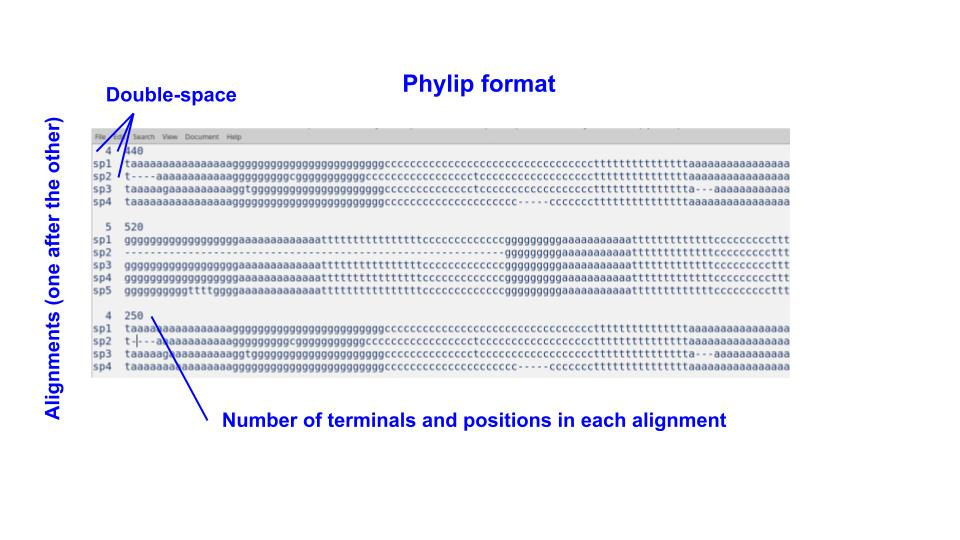

```{r klippy_bash, echo=FALSE, include=TRUE}
klippy::klippy('bash',
               position = c('top', 'right'),
               color = 'gray', 
               tooltip_message = 'Click to copy', tooltip_success = 'Done')
```

```{r klippy, echo=FALSE, include=TRUE}
klippy::klippy('r',
               position = c('top', 'right'),
               color = 'gray', 
               tooltip_message = 'Click to copy', tooltip_success = 'Done')
```

En `MCMCtree` es posible analizar datos de ADN, aminoácidos o morfología. El archivo de alineamientos debe tener la siguiente forma:

{#id .class width=80% height=80%}

### Convertir entre formatos

Usualmente los alineamientos de ADN y aminoácidos están en formato `fasta`. Es posible convertir a formato `phylip`usando el paquete `phangorn` de `R`.

```{r, class.source='klippy', eval=FALSE, results='hide'}
library(phangorn)

fpath <- "data/alignments"
  
## Podemos iterar sobre todos los alineamientos que tenemos en un directorio
alignms <- list.files(path=fpath, pattern="fas")

## Iterar los alineamientos
for(i in alignms){
  
  ## Read fasta
  alg_i <- read.phyDat(paste(fpath, i, sep = "/"), format = "fasta")
  
  ## Write phylip
  write.phyDat(alg_i, format = "phylip", colsep = "",
               file = paste0(fpath, "/", i, ".phy"))
  
  cat("Writing", i, "in phylip", "\n")
}
```

### Concatenar los alineamientos individuales
En este caso ya tenemos los alineamientos en formato `phylip`, solo tenemos que concatenarlos, para eso usamos `Bash`:

```{bash, class.source='klippy_bash'}
cd data/alignments

## En Bash tambien podemos iterar los alineamientos
for i in `ls *.phylip`; do cat $i >> concatenated.phylip; echo "" >> concatenated.phylip; done
mv concatenated.phylip ../ # mover el archivo una carpeta atrás
```